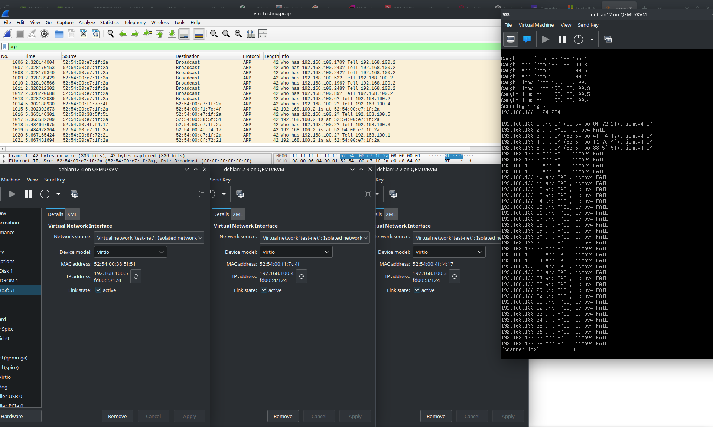
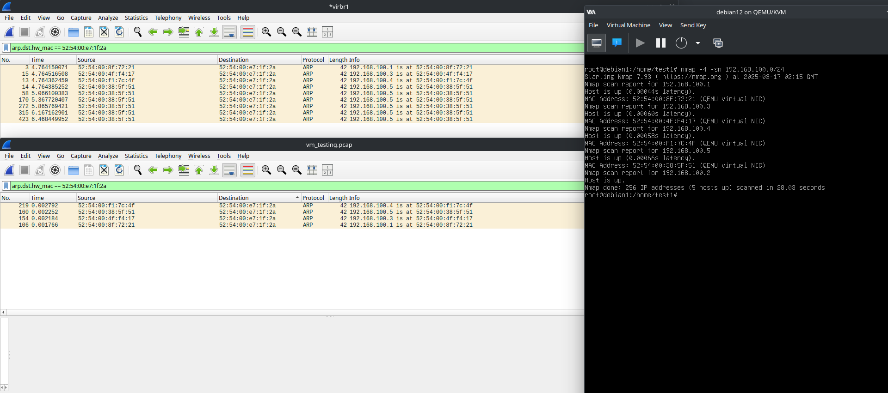
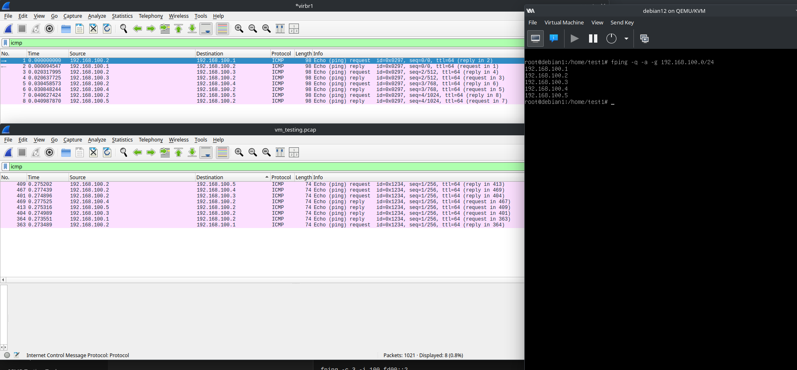
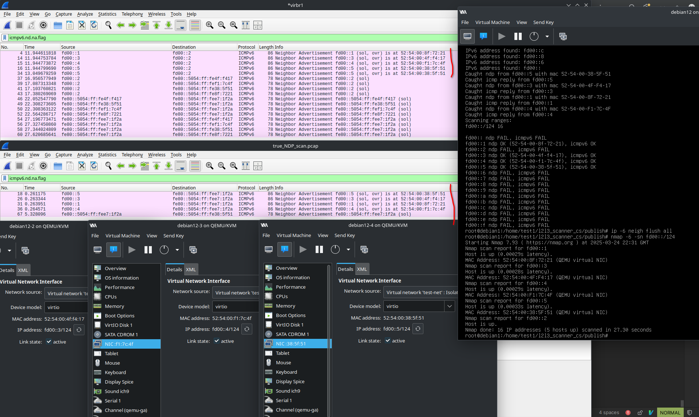
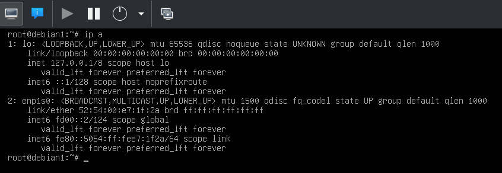
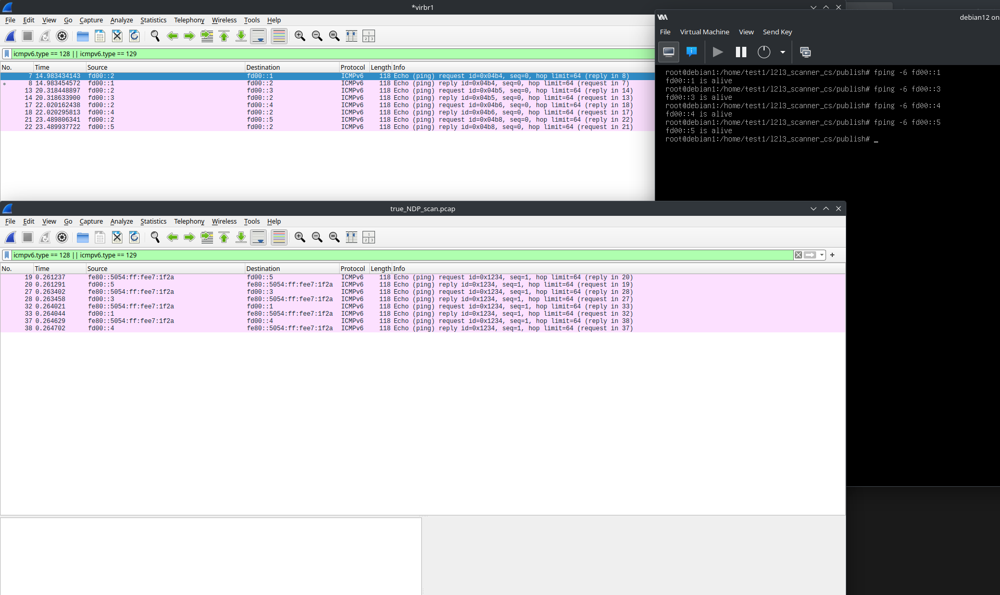

# Project 1 - DELTA: L2/L3 Scanner
---
- **Author:** Adam Běhoun
- **Login:** xbehoua00
---
This project is implemented in C# using .NET 8.0 in an object-oriented manner.

## Command-line arguments
Usage: `./ipk-l2l3-scan {-h} [-i interface | --interface interface] {-w timeout} [-s ipv4-subnet | -s ipv6-subnet | --subnet ipv4-subnet | --subnet ipv6-subnet]`

The command-line arguments are parsed using the `CommandLineParser` NuGet package. Additional validation is done using the methods from `ArgumentChecker.cs` file.

- If no arguments are provided, or only `-i/--interface` argument without value is provided (and any other option is not specified), the program lists active interfaces on the network.
- If the `-h` argument is provided, the program prints the help message and terminates.
- if the arguments are not valid, the program terminates with an error message.

#### Active interfaces on the network
The interface that has an IP address assigned is considered active. The program uses the `SharpPcap` library to determine the active interfaces. All the available interfaces are considered, but only those with at least one assigned IP address are filtered and listed afterwards.

```csharp
    private List<LibPcapLiveDevice> GetAvailableInterfaces() =>
        LibPcapLiveDeviceList.Instance.Where(d => d.Addresses.Count > 0).ToList();
```

## Subnet processing

The program has to extract all the available hosts from the specified subnet to start sending protocols to each one. The methods for this task are implemented in the `IpUtility.cs` file.

### Subnetting
Process of dividing a network into smaller networks called **subnets**. The boundary between the network address and the host address is defined by a backslash followed by a 32bit integer called **subnet mask**. For example: `192.168.167.14/24` [1]


### Calculating available hosts
Determining the number of available hosts in a subnet is done using formulas.
- Formula used for an IPv4 subnet is `2^(32 - subnet_mask) - 2`. The `-2` is there because the first and last addresses are reserved for the **network address** and **broadcast address**.
- Formula used fo an IPv6 subnet is `2^(128 - subnet_mask)`. The first and last addresses are not reserved in IPv6, so there is no need to subtract `2`.

### Extracting the IP addresses
The program uses the following algorithm to extract and store all the available IP addresses in the subnet. `List<IPAddress>` is used to store the addresses.

Let's take the previous example `192.168.167.14/24`. But the same algorithm is used for IPv6 addresses as well.

| Step | Description                                         | Calculation                     | Result          |
|------|-----------------------------------------------------|---------------------------------|-----------------|
| **1** | Represent the **IP address**                        | 192.168.167.14                  | -               |
| **2** | Represent the **subnet mask**                       | 255.255.255.0                   | -               |
| **3** | Perform AND operation to get the **network address** | 192.168.167.14 & 255.255.255.0  | 192.168.167.0   |
| **4** | Perform OR operation with **~subnet mask** to get the **broadcast address** | 192.168.167.14 \| 0.0.0.255     | 192.168.167.255 |
| **5** | Available usable hosts - each address between the network and broadcast address | 192.168.167.1 - 192.168.167.254 | **254 hosts**   |

After the `List<IPAddress>` is filled with all the available hosts, the program move them in a `ConcurrentDictionary<IPAddress, ScanResult>` where the `ScanResult` is a class that holds the information about the successes of the protocols. Now the program is ready to start sending the protocols to each host.

## Protocols

The program uses the **Factory** design pattern to create the protocols. `IProtocol.cs` is an interface that all the protocols have to implement. It consists of:
- `SendRequest`: Method that create the raw packet and sends it to the destination. 
- `CreateHeader`: Method that creates the header of the packet.
- `ProcessResponse`: Method that processes the response if there is any.

Sniffing the responses is done using the `SharpPcap` library. The program listens on the specified network interface using `OnPacketArrival` event handler. For effectivity, the filter is set to only listen for the desired protocols. On the packet arrival, the program loads the packet data using:

```csharp
byte[] rawEthPacket = e.GetPacket().Data;
```
After the packet is loaded, the program checks for significant bytes in the packet to determine the type of protocol and calls the corresponding `ProcessResponse` method.
Since the listening runs in a separate thread, the program cannot ensure that two or more responses are not processed at the same time. To prevent this, the `ConcurrentDictionary` is used to store the results.

### ARP protocol
The ARP protocol is used to map an IP address to a MAC address. It operates at the **Data Link Layer** of the OSI model. When the host wants to send a datagram to another host on the same network, it first searches its ARP table and if the **MAC address** of the destination is not found, it sends an **ARP request** to the network. [2]

- **ARP request**: The request is sent to the broadcast address of the network. Effectively asking all the hosts on the network: "Who has this IP address? Send me your MAC address."
- **ARP reply**: The reply is sent directly to the sender of the request, containing the MAC address.

#### Packet generation
The packet consists of ethernet header and ARP header. In the **ethernet header** the **destination MAC address** is specified to the broadcast address `ff:ff:ff:ff:ff:ff` and the **source MAC address** is the MAC address of the sender interface.
The **ARP header** contains unique values to specify the ARP request at byte 0-7. Then the **source MAC and IP address**, so the reply can be sent back directly. Then there is the **target MAC address** set to `00:00:00:00:00:00` (unknown) and the **target IP address**.

#### Packet sending
The packet is sent using the `SendPacket` method from the `LibPcapLiveDevice` class. It takes the created packet as a parameter.

#### Response processing
If the method `ProcessResponse` is called, it means that **ARP reply** arrived. The method extracts the **source MAC address** from the packet and sets the `MacAddress` and `ArpSuccess` properties in the `ScanResult` class accordingly.

### ICMPv4 protocol
ICMP messages are used for diagnostics and error reporting. The ICMPv4 protocol operates at the **Network Layer** of the OSI model. The data are encapsulated in the **IPv4 packet** datagram. [3]

In the manner of this project, the ICMPv4 **ping request** is sent to the destination host to determine if it is reachable.

#### Packet generation
The packet is initialized using `Socket` class. 
```csharp
using Socket socket = new Socket(AddressFamily.InterNetwork, SocketType.Raw, ProtocolType.Icmp);
```
The `socket` is then bound to the **source IP address** and the sufficient header is created. The header consists of the **echo request** type, checksum, identifier, and sequence number. Additionally, custom message is added to the packet as payload.
Checksum calculation is specified in the `Utilities/ChecksumUtility.cs` file and was generated by ChatGPT.

#### Packet sending
The packet is sent using the `SendTo` method. The created header and the destination IP address are passed as parameters.

#### Response processing
The method extracts the **source IP address** from the packet and sets the `IcmpSuccess` property in the `ScanResult` class accordingly.

### NDP protocol
The NDP protocol is used for the same purpose as ARP, but it operates on the same layer as the **ICMPv6** protocol. The NDP protocol is used in IPv6 networks and has various messages: [4]

- **Router Advertisement**: The router sends messages of its presence to the network periodically.
- **Router Solicitation**: The host sends a message to the network to ask for the router's presence.
- **Neighbor Solicitation**: The host sends a message to the network to ask for the MAC address of the specified IP address.
- **Neighbor Advertisement**: Response to the **Neighbor Solicitation** message. In case of the link-local address modification, the host sends the **Neighbor Advertisement** message to the network with sufficient flag.

In the manner of this project, the **Neighbor Solicitation** message is used to determine the MAC address of the specified IP address. The **destination IP address** is in special format called **solicited-node address** `ff02::1:ff00:{last 24 bits of the IP address}`.

#### Packet generation
The packet is initialized using `Socket` class. The `AddressFamily` is set to IPv6, `SocketType` to raw, and `ProtocolType` is set to ICMPv6 since the NDP protocol is a part of the ICMPv6 protocol.
```csharp
using Socket socket = new Socket(AddressFamily.InterNetworkV6, SocketType.Raw, ProtocolType.IcmpV6);
```
The packet consists of the **ICMPv6 header** with specified type of the **Neighbor Solicitation** message. The **destination IP address** and **source MAC address** are set accordingly. The checksum is calculated with the `ChecksumUtility` class and is generated by ChatGPT.

#### Packet sending
The packet is sent using the `SendTo` method. It takes the created header and the destination IP address in **solicited-node address** format as parameters. The method for the **solicited-node address** is implemented in the `IpUtility` class.

#### Response processing
The method extracts the **source IP and MAC address** and sets the `ArpSuccess` and `MacAddress` properties in the `ScanResult` class accordingly. 

### ICMPv6 protocol
The ICMPv6 protocol is used for diagnostics and error reporting in IPv6 networks [4]. The **NDP** protocol described before is a subset of the ICMPv6 protocol. It operates at the **Network Layer** of the OSI model. In the manner of this project, the **ICMPv6 echo request** is used to determine if the host is reachable.

#### Packet generation
The initialization of the packet is the same as in the **NDP** protocol. The `AddressFamily` is set to IPv6, `SocketType` to raw, and `ProtocolType` is set to ICMPv6.
```csharp
using Socket socket = new Socket(AddressFamily.InterNetworkV6, SocketType.Raw, ProtocolType.IcmpV6);
```
The packet consists of the **ICMPv6 header** that has the same structure as the **ICMPv4** header. The **echo request** type, checksum, identifier, and sequence number are set. The custom message is added as payload. The checksum is again calculated with the `ChecksumUtility` class.

#### Packet sending
The packet is sent using the `SendTo` method. The created header and the destination IP address are passed as parameters.

#### Response processing
The method extracts the **source IP address** from the packet and sets the `IcmpSuccess` property in the `ScanResult` class accordingly


## Testing
### Automated testing
The program uses `xUnit` for testing `IpUtility` class. It covers tests for the following test cases:
- Subnet mask represented as an integer to byte[] conversion
- Validation whether the subnet mask is valid (0-32 | 0-128)
- IPv4 and IPv6 address and subnet mask splitting
- Getting the next IP address after the specified one
- Getting the number of hosts in the subnet
- Extracting the IP addresses from the subnet
- Getting solicited-node address from the IPv6 address

### Manual testing
For the sake of testing, virtual isolated network consisted of four virtual machines was created. IPv4 and IPv6 addresses were assigned manually to each machine to have a full control over the results.
As the program ran, Wireshark from the local machine was used to capture the packets. The results were then compared with the `nmap` or `fping` tool to ensure the correctness of the program. Also, the unknown IP addresses were tested to ensure the program does not crash.

The subnets were set up as follows:
- **IPv4 subnet**: `192.168.100.0/24`
- **IPv6 subnet**: `fd00::/124`

The virtual machines were set up as follows:
- **Machine 1 (Performing the scan)**: IPv4: 192.168.100.2/24, IPv6: fd00::2/124
- **Machine 2**: IPv4: 192.168.100.3/24, IPv6: fd00::3/124
- **Machine 3**: IPv4: 192.168.100.4/24, IPv6: fd00::4/124
- **Machine 4**: IPv4: 192.168.100.5/24, IPv6: fd00::5/124

The results were as follows:

#### ARP testing
- The scan was performed on the IPv4 subnet `192.168.100.0/24` and saved to the `.pcap` file. Then the command `nmap -4 -sn 192.168.100.0/24` was executed to compare the results.

Output from the scanner:

The Wireshark displays ARP requests with expected ARP replies. The address `192.168.100.1` is the gateway address. The program correctly captured the MAC addresses of the IP addresses. There are 3 windows displaying the MAC addresses with the corresponding IP addresses that are the same as the scanner output.

But to be 100% sure, let's see the comparison between the scanner and `nmap` tool:



The Wireshark log at the top of the screen is the `nmap` capture. The Wireshark log at the bottom is opened `.pcap` file from the scanner. The `nmap` tool displayed the **same** results as the scanner.

#### ICMPv4 testing
Again the scan was performed on the IPv4 subnet `192.168.100.0/24` exactly `250ms` after the **ARP** packets sending. This delay allows **ARP** packets to be processed before the **ICMPv4** packets send their own **ARP** requests.

The scan results were compared with `fping` tool. The command `fping -q -a -g 192.168.100.0/24` shows only alive hosts and scan the whole subnet.



The Wireshark log at the top is a capture of the `fping` tool. The Wireshark log at the bottom is opened `.pcap` file from the scanner. Both logs are identical. Only difference is in the command-line results. `fping` tool also marks the machine it was executed from as alive, but this project does not on purpose.

#### IPv6 testing
The scan was performed on the configured IPv6 subnet `fd00::/124`. It was then compared with following command `nmap -6 -sn fd00::/124` for **NDP** confirmation. And since I haven't found any tool that would send **ICMPv6** echo requests to whole subnet, `fping 6` tool was used to ping at least those machines that were marked as alive by the scanner to confirm that they really are. 

#### NDP testing



The important packets in Wireshark are highlighted. The top log is the `nmap` capture. The bottom log is the scanner capture. The results are expected and the scanner captured the **MAC** addresses correctly. The only difference is the **destination IP address** of the **Neighbor Advertisement** messages. It is because the machine has a second **IPv6 address** and the scanner chose that one as the source address for the **NS** messages.



#### ICMPv6 testing



The top log is the `nmap` capture. The bottom one is the scanner log. The results are identical apart from the **source IP address** of the echo requests again.

## Bibliography
[1] VESELÝ. IPK2024/05 – Síťová vrstva – IPv4. [online]. Brno University of Technology, Faculty of Information Technology, 2024.

[2] POSTEL, Jon. An Ethernet Address Resolution Protocol: Or Converting Network Protocol Addresses to 48.bit Ethernet Address for Transmission on Ethernet Hardware. [online]. Internet Engineering Task Force (IETF), November 1982. RFC 826. Available at: https://datatracker.ietf.org/doc/html/rfc826.

[3] POSTEL, Jon. Internet Control Message Protocol. [online]. Internet Engineering Task Force (IETF), September 1981. RFC 792. Available at: https://datatracker.ietf.org/doc/html/rfc792.

[4] VESELÝ. IPK2020/21L – 06 – IPv6 síťová vrstva. [online]. Brno University of Technology, Faculty of Information Technology, 2020.